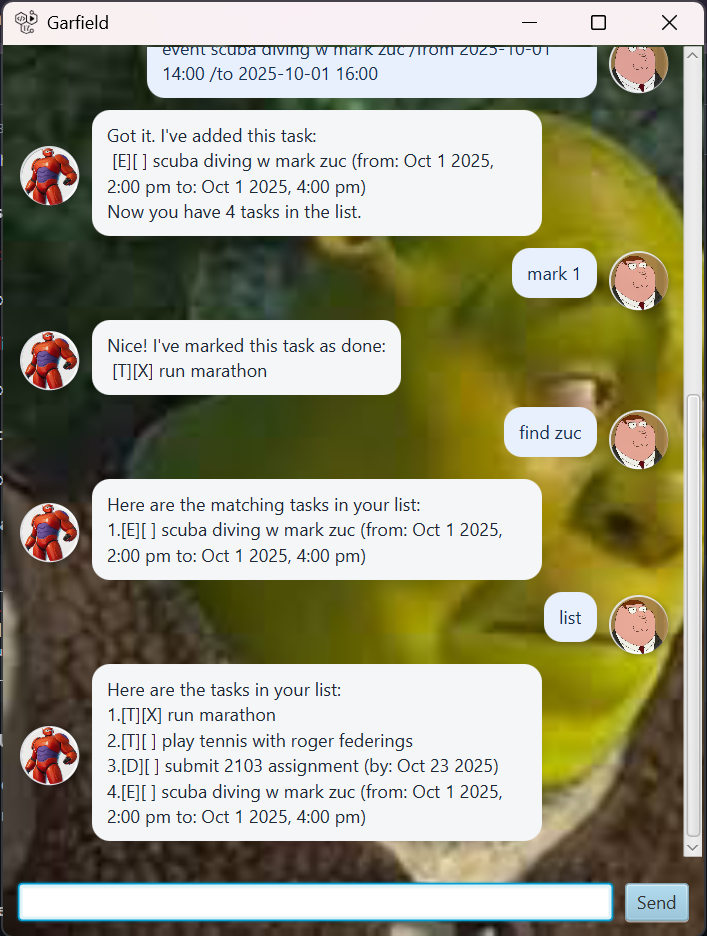

# Garfield User Guide

Garfield is a personal assistant chatbot that helps you track tasks easily via a command interface. It supports ToDos, Deadlines, Events, searching, marking/unmarking, deleting, and a useful snooze command to reschedule items. The data persists through multiple runs as it is stored locally on your computer.

---



## Table of Contents

* [Quick Start](#quick-start)
* [How to Run](#how-to-run)

  * [Run with Gradle](#run-with-gradle)
  * [Run from JAR](#run-from-jar)
* [Using the App](#using-the-app)

  * [Command Format](#command-format)
  * [Features](#features)
* [Date & Time Formats](#date--time-formats)
* [Storage](#storage)
* [GUI Notes](#gui-notes)
* [Testing](#testing)
* [Troubleshooting](#troubleshooting)
* [Command Summary](#command-summary)

---

## Quick Start

1. Ensure you have **Java 17** installed (`java -version`).
2. Clone your fork of the repo and open it in your IDE/terminal.
3. Run the app (see [How to Run](#how-to-run)).
4. Type commands into the input box (GUI) or stdin (CLI) — see [Features](#features).

---

## How to Run

### Run with Gradle

```bash
# From project root
./gradlew run          # macOS/Linux
# or
.\gradlew run          # Windows PowerShell / CMD
```

This launches the JavaFX with an app window called Garfield.

### Run from JAR

The FAT Jar will also be available on the [GitHub Releases page](https://github.com/syemfai/ip/releases). Run it in an empty folder:

```bash
java -jar Garfield.jar
```

---

## Using the App

### Command Format

* Words in **angle brackets** are parameters you supply, e.g., `<description>`.
* **Dates/times** accept several formats; see [Date & Time Formats](#date--time-formats).
* Commands are **case-insensitive** for keywords (e.g., `TODO` ≈ `todo`).

### Features

#### 1) Greet & Exit

* **Exit:** `bye`

  * Closes the app politely.

#### 2) List Tasks

* **List all:** `list`

  * Shows your tasks with indices.

#### 3) Add Tasks

* **ToDo:** `todo <description>`

  * Example: `todo read book`
* **Deadline:** `deadline <description> /by <when>`

  * Example: `deadline return book /by 2019-12-02`
* **Event:** `event <description> /from <start> /to <end>`

  * Example: `event project meeting /from 2019-10-01 14:00 /to 2019-10-01 16:00`


#### 4) Mark / Unmark

* **Mark completed:** `mark <task-number>`
* **Mark not completed:** `unmark <task-number>`

#### 5) Delete

* **Delete a task:** `delete <task-number>`

#### 6) Find

* **Search a task:** `find <keyword>`

  * Example: `find zuc`

#### 7) Snooze (Reschedule)

> *Extension: B‑Snooze*

Reschedule **Deadlines** or **Events** without re-adding them.

* **Deadline:** `snooze <task-number> /by <when>`

  * Example: `snooze 3 /by 2025-09-15`
* **Event:** `snooze <task-number> /from <start> /to <end>`

  * Example: `snooze 4 /from 2025-09-20 09:00 /to 2025-09-20 11:00`

If the new date/time is recognized, the task displays a **prettified** date (e.g., `Sep 15 2025` or `Sep 20 2025, 11:00 AM`).

#### 8) Error Handling

The bot gives clear messages for invalid inputs, e.g., missing description, out-of-range indices, or wrong formats. Try `help` (if enabled in your build) or refer to this guide.

---

## Command Summary

| Action       | Command                                        |
| ------------ | ---------------------------------------------- |
| Add ToDo     | `todo <description>`                           |
| Add Deadline | `deadline <description> /by <when>`            |
| Add Event    | `event <description> /from <start> /to <end>`  |
| List         | `list`                                         |
| Mark         | `mark <task-number>`                           |
| Unmark       | `unmark <task-number>`                         |
| Delete       | `delete <task-number>`                         |
| Find         | `find <keyword>`                               |
| Snooze (DL)  | `snooze <task-number> /by <when>`              |
| Snooze (EV)  | `snooze <task-number> /from <start> /to <end>` |
| Exit         | `bye`                                          |

---

## Date & Time Formats

Garfield accepts multiple common input formats and prints **friendly** dates.

**Accepted inputs (examples):**

* **Date only**

  * `2019-12-02` (ISO)  → **Dec 2 2019**
  * `15/09/2025` or `1/9/2025` → **Sep 15 2025**, **Sep 1 2025**
  * `Sep 12 2025`, `September 12 2025`
* **Date + time**

  * `2019-12-02 1800` or `2019-12-02 18:00` → **Dec 2 2019, 6:00 PM**
  * `1/10/2019 14:00` → **Oct 1 2019, 2:00 PM**
  * `Sep 12 2025 09:30` → **Sep 12 2025, 9:30 AM**

> Note: Abbreviate months as `Jan, Feb, Mar, Apr, May, Jun, Jul, Aug, Sep, Oct, Nov, Dec` (not `Sept`). Unrecognized inputs are kept as‑is.

---

## Storage

* File: `data/garfield.jsonl`
* Format: **JSON Lines** (one JSON object per line).
---

## Testing

### 1) Text‑UI Testing (for CLI)

A semi-automated test harness is provided in `text-ui-test/`:

```bat
text-ui-test\runtest.bat
```

It compiles sources, runs the app with `input.txt`, and compares the output with `EXPECTED.TXT`.

### 2) JUnit Tests

Run unit tests with:

```bash
./gradlew test
```

---